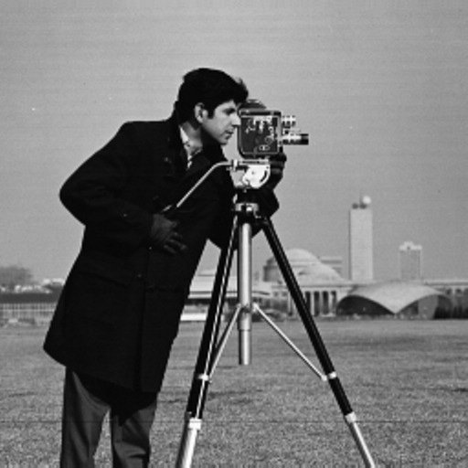

# Scope

This project aims to use an orthonormal decomposition in 2D wavelets as operator L. This decomposition allows to have a view at several scales of the image. To do this we used the PyWavelets python package.

# Virtual environment
To run this project, please start by activate the built-in virtual environment. Once in the ```imagedenoising``` directory, you can use the following command: ```source bin/activate```. No other requirements are needed to run the ```code_project.py``` file.

# Project

1. Input image



<div style="page-break-after: always;"></div>

2. Image decomposition into multiple resolutions/levels using the discrete wavelet transform algorithm


<div style="page-break-after: always;"></div>

3. Adding a Gaussian noise with mean=0 and standard deviation=30 to the original image.


<div style="page-break-after: always;"></div>

4. Decomposing the noised image into multiple resolutions/levels using the discrete wavelet transform algorithm


<div style="page-break-after: always;"></div>

5. Denoising the image using wavelet transform:

The discrete wavelet transform (DWT) of a given image returns the approximation, horizontal detail, vertical detail and diagonal detail coefficients.
The DWT of the original image (Fig.1) returns coefficients with distinct shapes.
When we add a Gaussian noise to the original image of mean=0 and sd =30, the DWT coefficients return a **less but still distinguishable shapes**.
This difference is of course expected because of the noise added to the original image.
This difference suggests DWT coefficients with more sparsity for the original image than those of the noised one which explain more distinguishable shapes on the different levels of decomposition of the original image compared to those of the noised image.

<div style="page-break-after: always;"></div>

6. Finding the best learning rate (lambda) that returns the lowest mean square error (MSE) between the original image and the noised-denoised one.
 value between the original image and image x_hat")


